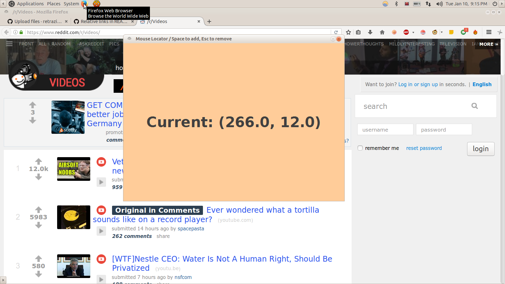
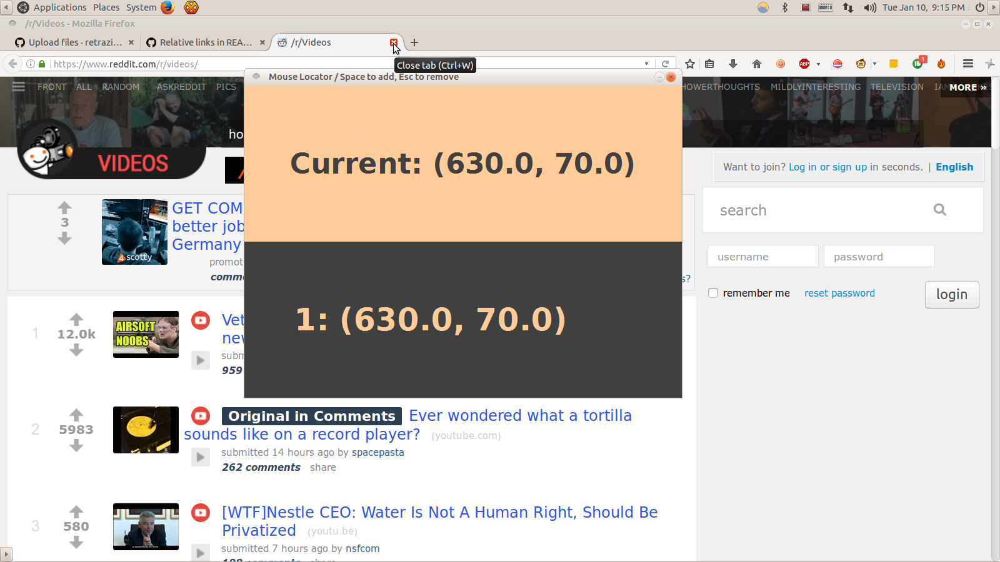
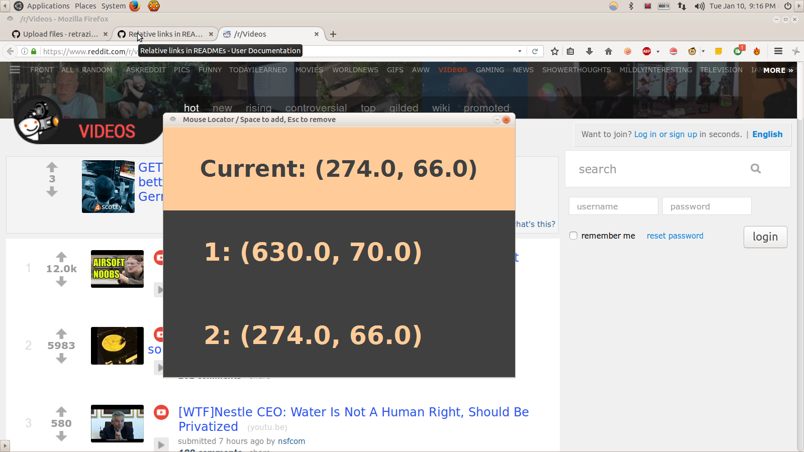

# Mouse Locator
A basic gui program to find co-ordinates of cursor on screen. I made this to use with Robot class. I was creating a Robot automatiion program which used Mouse to click at particular location on screen. I thought it would be nice to have a program which would show cursor co-ordinates in real time (in a gui) and if I could temporarily save the co-ordinates I wanted. 

<b>Default Look:</b> 

<b>First Saved Location</b> (Press <b>Space</b> to save the current location cursor is pointing at):

<b>Second Saved Location</b> (Press <b>Space</b> to save the current location cursor is pointing at):

And so on. Maximum Limit of saved locations is <b>3</b>. You can copy the saved location by selecting it using mouse. To delete a saved location, press <b>ESC</b> key.

<b>There's an executable jar at /dist/</b>
